# SentinelIQ System Architecture

SentinelIQ is an ML-based endpoint ransomware detection and Cyber Threat Intelligence (CTI) sharing platform. Telemetry from Windows Sysmon is collected by a Python agent, converted into 21 behavioral features over 10-second sliding windows, and evaluated by an XGBoost ML classifier with EMA smoothing. Detections are ingested into the backend for threat intelligence matching and 120-second cross-endpoint correlation, driving automated process and network isolation while anchoring immutable CTI report hashes to the Polygon Amoy blockchain.

```mermaid
flowchart LR

    %% =========================================================================
    %% LAYER 1: ENDPOINT & MONITORING
    %% =========================================================================
    subgraph L1 ["1. ENDPOINT & MONITORING"]
        EP_WIN["<b>Windows Endpoint</b><br/><i>Workstations & Servers</i>"]
        EP_SYS["<b>Sysmon Telemetry</b><br/><i>Process, File, Reg, Net, DNS</i>"]
        EP_AGT["<b>Python 3.11 Agent</b><br/><i>Polls Sysmon every ~3s</i>"]
        
        EP_WIN --> EP_SYS --> EP_AGT
    end

    %% =========================================================================
    %% LAYER 2: DATA PROCESSING
    %% =========================================================================
    subgraph L2 ["2. DATA PROCESSING"]
        DP_WIN["<b>10s Sliding Window</b><br/><i>PID Grouping & Buffer</i>"]
        DP_FEAT["<b>21 Behavioral Features</b><br/><i>Entropy, Rates & Paths</i>"]
        
        DP_WIN --> DP_FEAT
    end

    %% =========================================================================
    %% LAYER 3: ML DETECTION
    %% =========================================================================
    subgraph L3 ["3. ML DETECTION"]
        ML_XGB["<b>XGBoost Classifier</b><br/><i>Risk Probability: 0.0 - 1.0</i>"]
        ML_EMA["<b>EMA Smoothing</b><br/><i>α = 0.4 Filter</i>"]
        ML_EVAL["<b>Threshold Evaluator</b><br/><i>≥0.50 Susp. | ≥0.65 Alert | 3x Crit.</i>"]
        
        ML_XGB --> ML_EMA --> ML_EVAL
    end

    %% =========================================================================
    %% LAYER 4: THREAT ANALYSIS & BACKEND
    %% =========================================================================
    subgraph L4 ["4. THREAT ANALYSIS & BACKEND"]
        BE_SRV["<b>Backend Services</b><br/><i>Node.js / Express • MongoDB</i>"]
        BE_CORR["<b>120s Correlation & Policy</b><br/><i>Multi-Host Attack Engine</i>"]
        
        BE_SRV --> BE_CORR
    end

    %% =========================================================================
    %% BRANCH 5A: AUTOMATED RESPONSE
    %% =========================================================================
    subgraph L5_RESP ["AUTOMATED RESPONSE"]
        ACT_RESP["<b>Mitigation Actions</b><br/><i>Kill Process • Host Isolation</i>"]
    end

    %% =========================================================================
    %% BRANCH 5B: CTI & BLOCKCHAIN
    %% =========================================================================
    subgraph L5_CTI ["CTI & BLOCKCHAIN"]
        CTI_FLOW["<b>CTI Draft & SHA-256</b><br/><i>IoC Report • Hash Digest</i>"]
        BC_AMOY["<b>Polygon Amoy</b><br/><i>CTIRegistry.sol On-Chain</i>"]
        
        CTI_FLOW --> BC_AMOY
    end

    %% =========================================================================
    %% BRANCH 5C: SECURITY DASHBOARD
    %% =========================================================================
    subgraph L5_DASH ["SECURITY DASHBOARD"]
        DASH_UI["<b>SOC Dashboard</b><br/><i>Next.js 15 • Socket.IO Stream</i>"]
    end

    %% =========================================================================
    %% INTER-LAYER DATA FLOWS
    %% =========================================================================
    EP_AGT -->|"Raw Logs"| DP_WIN
    DP_FEAT -->|"21 Features"| ML_XGB
    ML_EVAL -->|"Detections (≥0.50)"| BE_SRV

    BE_CORR -->|"Critical Rule"| ACT_RESP
    BE_CORR -->|"Attack Campaign"| CTI_FLOW
    BE_CORR -->|"Live Telemetry"| DASH_UI

    ACT_RESP -.->|"Kill PID / Isolate"| EP_WIN
    BC_AMOY -.->|"Verify On-Chain"| DASH_UI

    %% =========================================================================
    %% STYLING: CONTAINERS & INNER COMPONENTS
    %% =========================================================================
    style L1 fill:#0f172a,stroke:#38bdf8,stroke-width:1.5px,stroke-dasharray: 4 4,color:#e2e8f0;
    style L2 fill:#0f172a,stroke:#38bdf8,stroke-width:1.5px,stroke-dasharray: 4 4,color:#e2e8f0;
    style L3 fill:#1e1035,stroke:#c084fc,stroke-width:1.5px,stroke-dasharray: 4 4,color:#e2e8f0;
    style L4 fill:#0a192f,stroke:#60a5fa,stroke-width:1.5px,stroke-dasharray: 4 4,color:#e2e8f0;
    style L5_RESP fill:#2a0d0d,stroke:#f87171,stroke-width:1.5px,stroke-dasharray: 4 4,color:#e2e8f0;
    style L5_CTI fill:#271202,stroke:#fb923c,stroke-width:1.5px,stroke-dasharray: 4 4,color:#e2e8f0;
    style L5_DASH fill:#042f2e,stroke:#2dd4bf,stroke-width:1.5px,stroke-dasharray: 4 4,color:#e2e8f0;

    classDef epBox fill:#1e293b,stroke:#0ea5e9,stroke-width:1.5px,color:#f8fafc;
    classDef dpBox fill:#1e293b,stroke:#38bdf8,stroke-width:1.5px,color:#f8fafc;
    classDef mlBox fill:#3b0764,stroke:#a855f7,stroke-width:1.5px,color:#f8fafc;
    classDef beBox fill:#172554,stroke:#3b82f6,stroke-width:1.5px,color:#f8fafc;
    classDef respBox fill:#450a0a,stroke:#ef4444,stroke-width:1.5px,color:#f8fafc;
    classDef ctiBox fill:#431407,stroke:#f97316,stroke-width:1.5px,color:#f8fafc;
    classDef dashBox fill:#064e3b,stroke:#10b981,stroke-width:1.5px,color:#f8fafc;

    class EP_WIN,EP_SYS,EP_AGT epBox;
    class DP_WIN,DP_FEAT dpBox;
    class ML_XGB,ML_EMA,ML_EVAL mlBox;
    class BE_SRV,BE_CORR beBox;
    class ACT_RESP respBox;
    class CTI_FLOW,BC_AMOY ctiBox;
    class DASH_UI dashBox;
```

